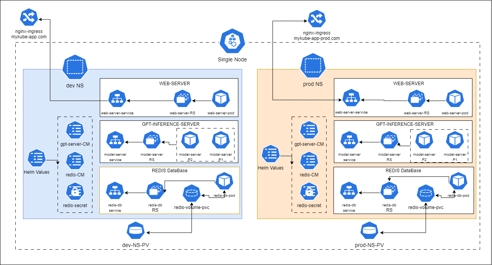
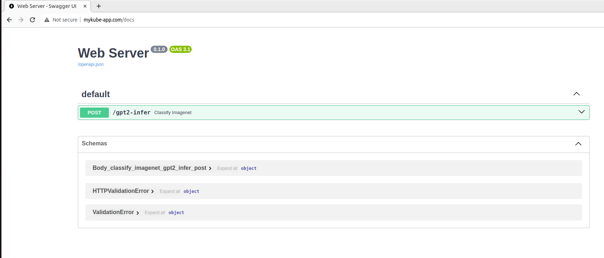
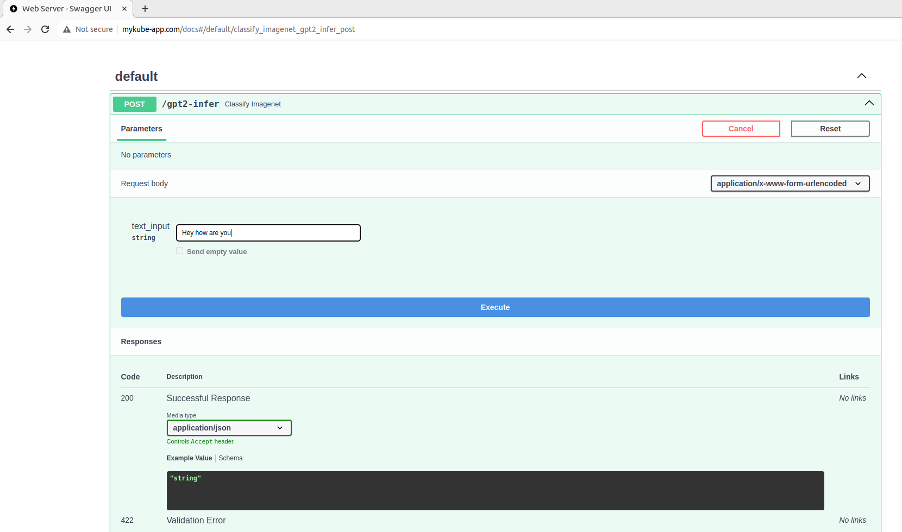
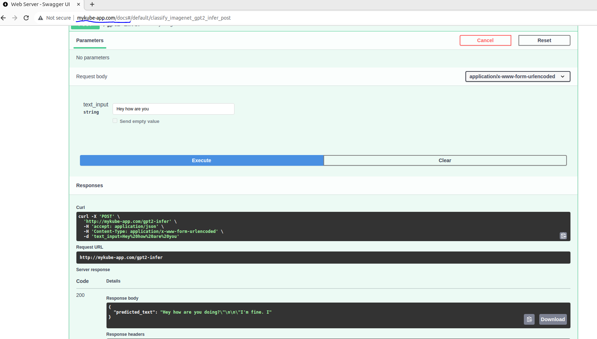

# AWS EKS deployment (EMLO assignment 18)
This project focuses on deploying three services to perform GPT2 based inference on AWS EKS service. This project is a part of assignment from EMLO.

## Introduction
This project uses Helm to deploy three services on AWS EKS created cluster:
- FastAPI based web service
- GPT2 inference server
- Redis DataBase for caching

We will also setup Cluster-Autoscaling to automatically scale nodes if required as well as Horizontal-Pod-Autoscaling to scale our GPT pod when load increases.
## Deployment overview
First lets go through the overview and flow of deployment. Below is the flow diagram representing our target deployment workflow:

 

Lets go through few important points:
- We are using single Node based deployemnt using minikube.
- We have two isolated and identical deployments on two different namespace `dev` & `pro`
- We have two different ingress and persistant volume as they can't be isolated via namespace.
- We have `web-server`, `gpt-inference-server` and `redis database.`
    - web-server has single pod replica
    - gpt-inference-server has two replica of pod 
    - single pod for redis database.

## Prerequisite
Below are few required Prerequisite to deploy this project:
- Minikube installed
- Docker and docker-compose
- Helm installed
- `make` to build project via Makefile
- `eksctl` cli installed
- aws cli logged in with proper EKS access

## Steps to perform deployment
Lets go through the steps to perform EKS cluster creation and helm deployment

#### 1. Building and pushing images
First we have to build and push image to docker registery so that we can pull it in aws cluster.
1. set proper username and project in makefile.
2. run `make build-images` to build image.
3. run `make push-images` to push image to registery.

image src code is in `src/` directory

#### 2. Creating Cluster using EKS on AWS
Now lets create cluster on AWS using EKS. We will use `eks-cluser.yaml` file to create a cluster with spot-instance.
 
Run command  -> `make create-eks-cluster`  

#### 3. Setting up ingress for internet access & setting up Cluster-Autoscaling
I have created a shell script `irsa.sh` which has command to perform following steps:
1. Create oidc-provider for the created cluster.
2. Create custom IAM policy for ALB to use in ingress and for Cluster-Autoscaler.
3. Create iamserviceaccount for ALB and for Cluster-Autoscaler.
4. Install ALB via Helm.

To do all the above just run `make set-hpa-ca` it will run the script and will setup everyting.

#### 4. Starting service deployment using Helm
Now to deploy the services via Helm run `make helm-deployment`.
This will deploy all the services.
 
To get internet facing ingress hostname you can look into ingress pod.

## Stress testing deployment
install python requests and set url to perform stress testing by running `python stress-testing.py`

## Inference output
Lest see how to use `mykube-app.com/docs` api page to perform inference.
1. Access the API page `http://mykube-app.com/docs`. You will see below page.

2. Try out first post api and add your text as shown below.

3. Execute and see the output text.

4. You can try it with same input and inference will be much faster as the data is been cached for faster inferece.
